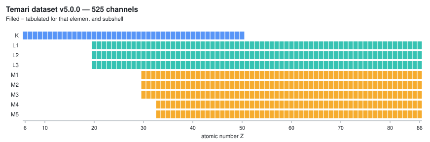
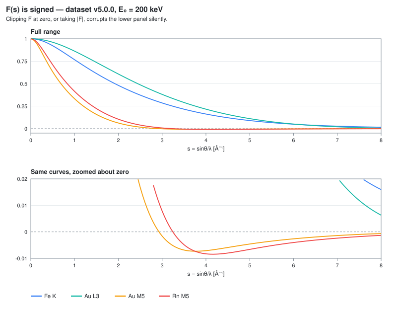

# Data

Two datasets are **published in their own right**, each with its own version
line. You do not need to run anything, and you do not need Julia.

| | Dataset | Version | Where |
|---|---|---|---|
| **F(s, E₀)** | Inner-shell ionization form factors for STEM-EDX, 525 channels | dataset **5.0.0** | Zenodo [10.5281/zenodo.21872050](https://doi.org/10.5281/zenodo.21872050) · GitHub release [`dataset-v5.0.0`](https://github.com/seto77/Temari/releases/tag/dataset-v5.0.0) |
| **f_x(s), f_e(s)** | X-ray and electron atomic scattering factors, 86 neutral atoms | dataset-factors **1.0.0** | GitHub release [`dataset-factors-v1.0.0`](https://github.com/seto77/Temari/releases/tag/dataset-factors-v1.0.0) (no DOI yet) — see [below](#factors) |

The two are different families of numbers. $F(s, E_0)$ describes how an
*inner-shell ionization* is distributed in momentum transfer, for one element,
one subshell and one beam energy; it is what a STEM-EDX or ALCHEMI simulation
needs. $f_x(s)$ and $f_e(s)$ are the ordinary *elastic* atomic scattering
factors of X-ray and electron crystallography — the numbers that
Waasmaier & Kirfel (1995) or Peng et al. (1996) parameterize — computed here
from the same atom instead of read from a fit.

## Inner-shell ionization form factors F(s, E₀) — dataset v5.0.0

!!! warning "Read this page before using the numbers"
    F is signed, the momentum convention is q = 4πs, values past `s_cert` are
    padding rather than physics, and the E₀ axis differs from channel to
    channel. Each of these has been observed to break a consumer. They are set
    out under [The contract](#the-contract) below, and checked by an executable
    reference loader shipped inside the archive.

### Where to get it

| | |
|---|---|
| **Record of reference** | Zenodo, [10.5281/zenodo.21872050](https://doi.org/10.5281/zenodo.21872050) — the version DOI |
| **Mirror** | [GitHub release `dataset-v5.0.0`](https://github.com/seto77/Temari/releases/tag/dataset-v5.0.0) |
| Size | 45 MB compressed, 112 MB expanded |
| Licence | **data CC-BY-4.0**, bundled loader MIT |

The two copies are **byte-identical**. The archive is built deterministically —
sorted entries, mtime pinned to the dataset's own date, fixed ownership, no
gzip timestamp — so the copy on Zenodo and the copy on GitHub can be *compared*
rather than merely trusted.

```bash
sha256sum -c temari-dataset-v5.0.0.tar.gz.sha256   # the archive
tar -xzf temari-dataset-v5.0.0.tar.gz && cd temari-dataset-v5.0.0
python tools/temari_contract.py .                  # the contents; non-zero on failure
```

`temari_contract.py` needs nothing but the Python standard library.

**Browsing before downloading:** the channel index is committed to the
repository as
[`tables/channels.csv`](https://github.com/seto77/Temari/blob/main/tables/channels.csv)
— 525 rows, rendered by GitHub as a searchable table. It answers "is my element
and edge in here?" without a 45 MB download.

### What is in it



Version **5.0.0**, schema **2**, generated with Temari on Julia 1.11.9.

| | |
|---|---|
| Channels | **525** — K, L1–L3, M1–M5 |
| Rows (channel × E₀) | **14,796** |
| Momentum grid | s = 0 … 16 Å⁻¹, **321 uniform nodes** (step 0.05 Å⁻¹) |
| Model | `DHFS-KS23-DiracB-KDIRAC2C-jsplit-fullrange-sym-v4-DSCF` |

Coverage by shell:

| Shell | Z range | Channels |
|---|---|---:|
| K | 6 – 50 | 45 |
| L1, L2, L3 | 20 – 86 | 67 each |
| M1, M2, M3 | 30 – 86 | 57 each |
| M4, M5 | 33 – 86 | 54 each |

!!! example "What a channel is"
    A channel is one element and one subshell — `F_K_Z26.json` is iron's K
    shell (1s), `F_L3_Z79.json` is gold's L3 shell (2p₃/₂). Each channel file
    holds one **row per beam energy** $E_0$; the Fe K file has 28 rows from
    30 keV to 400 keV. A row carries `F` (321 values on the s grid),
    `s_cert_A_inv`, `tail.eps`, `sigma_bote_nm2`, `sigma_own_nm2`, the
    overvoltage `u` = E₀/E_edge, and solver diagnostics. The channel-level keys
    give the edge energy used as threshold (`e_th_keV_bote`, 7.083 keV for
    Fe K), the model id, the s grid and the provenance.

### What F is

$F(s, E_0)$ is the **shape** of the inner-shell ionization form factor,
normalized so that $F(0) = 1$. It is the quantity STEM-EDX and ALCHEMI need:
the mixed dynamic form factor evaluated for the difference vector between two
Bloch waves, which is what makes an EDX map depend on the crystal orientation.

- **s is $\sin\theta/\lambda$ in Å⁻¹**, the crystallographic convention. The
  momentum transfer is **q = 4πs**, so K = 4πs·a₀ in atomic units. For example,
  s = 0.5 Å⁻¹ is q = 6.28 Å⁻¹, or K = 3.32 a₀⁻¹.
- **F is not a GOS** and must not be substituted for one: a generalized
  oscillator strength keeps the energy loss as a variable and is positive; F
  has the loss integrated out and is signed.
- **F is not a cross section.** The absolute scale is supplied separately by
  `sigma_bote_nm2`, from the coefficients of Bote et al. (2009).

### The contract { #the-contract }

These are not stylistic preferences. Each has been observed to break a
consumer, and each is checked by `temari_contract.py`.



1. **F is signed.** 358 of the 525 channels contain negative values, the
   smallest being −0.3194. Any path that treats F as non-negative — `clip(0)`,
   `abs`, an assumption of monotonicity — corrupts it silently, and the
   corruption survives integration over q. This is why F is *not* published in
   the GOSH format, whose consumers clip.
2. **q = 4πs.** Using s directly as a momentum is wrong by 4π.
3. **Beyond `s_cert` the values are exactly-zero padding, not calculated.**
   Every row declares how far it reaches. 1,598 rows (10.8 %) stop short of
   16 Å⁻¹. Feeding the padding into an interpolation basis drags the result
   toward zero.
4. **The E₀ axis differs from channel to channel** — 459 distinct axes across
   525 channels, 22 to 40 rows each. There is no dense [channel, E₀, s] cube
   over the union axis. (The 22 *absolute* nodes, 30 keV to 400 keV, are present
   in every channel; the per-channel overvoltage nodes are what differ.)
5. **`eps` is an upper bound and must not be interpolated in E₀.** Take the
   maximum of the two bracketing rows — an interpolated bound is not a bound.
6. **E₀ interpolation runs in x = ln(u−1), with y = log F for the s columns
   whose values are all positive** and raw F otherwise, over the rows whose
   `s_cert` reaches that column. Interpolating in raw E₀ over raw F gives
   different answers from the shipping consumer — up to 2.9×10⁻³, with the sign
   reversed in places.
7. **Past `s_cert` there are two distinct regions.** Between `s_cert` and
   `s_kin` = 1/λ(E₀) the value is unrecorded and carries the bound `eps`. Above
   `s_kin` no such beam pair exists on the Ewald sphere at all, so the request
   itself does not stand — attaching a bound there would be guaranteeing
   something about a configuration that cannot occur.

`s_kin` is the geometric limit — two beams on the Ewald sphere of radius
$1/\lambda$ can be at most a diameter $2/\lambda$ apart, and since
$s = |\Delta k|/2$ that is $s = 1/\lambda$ — and `s_cert` = min(16, 0.98·`s_kin`)
rounded down to a grid node is the recorded guarantee, 2 % inside it. Neither is
an accuracy limit.

!!! example "One row, worked through"
    Fe K at 30 keV: λ = 0.0698 Å, so `s_kin` = 14.33 Å⁻¹, 0.98·`s_kin` = 14.04,
    and the row records `s_cert_A_inv` = 14.0 with `tail.eps` = 5.9×10⁻³. Its
    `F` holds computed values on the 281 nodes 0 … 14.0 and exact zeros on the
    40 nodes above. At 200 keV, 1/λ = 39.9 Å⁻¹, so every node up to 16 is
    certified and `s_cert` = 16.

    To evaluate the channel at $E_0$ = 160 keV, which is not a row (the
    neighbouring rows are 150 and 170 keV): form x = ln(u − 1) with
    u = 160/7.083 and evaluate, column by column, the shipping interpolant —
    a monotone cubic (PCHIP) in x through every row whose `s_cert` reaches
    that s, on log F when the column is all-positive — at that x. For `eps`
    take the larger of the two bracketing rows. `temari_contract.py` does
    exactly this and carries a golden vector a port must reproduce.

### How far the numbers are trusted

- **QC**: 525 / 525 channels pass, zero generation-gate failures. The
  leave-one-out check on the E₀ axis worst-cases at 1.16×10⁻³ against a gate of
  5×10⁻³.
- ⚠ **That leave-one-out figure is not an error bound on E₀ interpolation.**
  It omits the two nodes at each end of the axis, so the region just above
  threshold and the 400 keV side are structurally blind to it. Direct
  measurement inside the intervals exceeds it in part of the range (worst
  3.0×10⁻³, just above threshold; see [Verification](verification.md#c6-is-not-a-bound)).
- ⚠ **External yardsticks are few, and none reaches 16 Å⁻¹.** For the
  generalized oscillator strength the most recent published database in the
  field, the Dirac GOS database (Zhang et al., 2023), stops at q = 50 Å⁻¹,
  which is s = 3.98 Å⁻¹ in this convention. For F(s) itself there are two
  computed shape tables: Oxley & Allen (2000) to s = 2.5 and the µSTEM shape
  factors (Allen et al., 2015) to s = 20 — both K and L shells, both from a
  local-exchange atom with a one-component continuum. Against them the shape
  agrees within 1 % up to s ≈ 0.75 (Si K), 2 (Fe K) and 0.3 Å⁻¹ (Fe L shell)
  and falls below them beyond, most of the departure lying above the
  s < 2 Å⁻¹ range the tested observables respond to; the curves are on the
  [comparison page](comparison.md#f-s). Everything else about the high-s
  region rests on internal identities and analytic limits, not on anyone
  else's numbers.
- **The absolute cross sections are Bote–Salvat, not this calculation.**
  The RMS deviation of the Bote et al. (2009) formulas from experiment is
  10 % (K), 15 % (L) and 24 % (M) (Llovet et al., 2014). `sigma_own_nm2` is
  reported alongside as an internal consistency indicator — it is a
  diagnostic, **not a validation score**, and Bote–Salvat is not ground truth
  either.

See [Verification](verification.md) for what is checked and how.

## Atomic scattering factors f_x(s), f_e(s) — dataset-factors v1.0.0 { #factors }

The X-ray atomic scattering factor $f_x(s)$ [electrons] and the first-Born
electron scattering factor $f_e(s)$ [Å] for the **86 neutral atoms Z = 1–86**,
from a fully relativistic (Dirac) self-consistent field with KLI exchange —
the exchange-only KLI approximation to the optimized effective potential (OEP)
of Krieger et al. (1992). This is a *different dataset
family* from F(s, E₀): no E₀ axis, an independent version line, and its own
release
[`dataset-factors-v1.0.0`](https://github.com/seto77/Temari/releases/tag/dataset-factors-v1.0.0)
(CC-BY-4.0 for the data, MIT for the bundled loader). **No DOI has been minted
yet**; until one exists, cite the versioned release tag and identify the archive
by its published SHA-256.

### What is in it

86 files `SF_Z<zzz>.json`, one per atom, each with f_x and f_e on the fixed grid
s_i = 6 i / 7680 (i = 0..7680, 7681 nodes, 0 ≤ s ≤ 6 Å⁻¹), decimal-rounded to
11 significant digits; radial moments M₂, M₄, M₆, M₈; the prescription; a
generation-time gate ledger; and provenance (generator commit and a source
fingerprint). Model `DHFS-KLI-DTM1-dt16-neutral-v1`, schema 1, generated with
Temari on Julia 1.12.6 (pinned in the archive's `MANIFEST.md`). γ (the
incident-electron relativistic factor) is **not** included in f_e — the same
first-Born convention as Doyle & Turner (1968) and Peng et al. (1996); the
crystal-potential code applies γ itself.

### The contract

Each of these is checked by the executable contract shipped in the archive
(`tools/temari_factors_contract.py`, Python standard library only) and has a
negative mutant showing that the check detects it:

1. **The s grid is not stored.** Reconstruct s_i = 6·i/7680 in binary64
   (`6.0*i/7680`) and check that the SHA-256 of the float64 little-endian byte
   stream equals `1476113c622ccb9e62d4b56973277b7e550fef44357cf42d7923a9dde84f32fb`.
2. **f_x is interpolated in s with a clamped left end (f_x′(0) = 0) and a
   not-a-knot right end.** Evenness in s makes f_x′(0) = 0 exact; not-a-knot at
   the left end costs a factor ~10 in the first interval and exceeds the
   representation budget for Cs and Ba.
3. **f_e is interpolated in t = s², not in s, with not-a-knot at both ends.** The
   t nodes are non-uniform (t_i = s_i²).
4. **The domain is [0, 6] Å⁻¹ inclusive and nothing else.** No extrapolation, no
   clamping. s is sinθ/λ in Å⁻¹ (q = 4πs).
5. **Values are 11-significant-digit decimals stored as JSON numbers.** Parse as
   binary64; do not re-round.

!!! example "Why the spline convention is part of the contract"
    The archive carries golden vectors — C, Fe, Cs and Au at off-knot values of
    s, tolerance 1e-12. Evaluate them with the reference loader and they pass;
    evaluate f_x with a not-a-knot condition at s = 0 instead of the clamped one
    and the first-interval error grows by a factor ~10 — enough to exceed the
    representation budget for Cs and Ba (1.22× and 1.19× B_repr) — so the
    golden vector, whose points include first-interval midpoints, fails. That
    is what
    "checked by a negative mutant" means: each rule has a deliberately broken
    variant that the check is shown to catch. A Julia reference loader and
    SciPy's `CubicSpline` agree with the Python contract to 4×10⁻¹⁶.

```bash
tar -xzf temari-factors-v1.0.0.tar.gz && cd temari-factors-v1.0.0
python tools/temari_factors_contract.py . --negative     # exits non-zero on failure
```

### How far the numbers are trusted

The release budgets are T_comp = 1e-7 electrons (f_x) and T_comp,e = 1e-7 Å
(f_e). They are **acceptance budgets** — supported by measured differences and
conservative allocations, not by an a-priori error theorem:

- the radial grid dt/16 was certified element by element (density L¹ bound,
  worst 0.58 × B_grid);
- the SCF stopping error of every shipped solve was measured against a τ/10
  reference (worst 0.39 × B_scf);
- the interpolation-plus-rounding error was measured on sealed midpoints for all
  86 elements (worst 0.16 × B_repr for f_x, 0.34 × B_repr,e for f_e);
- the sensitivity to the tested endpoint extensions of the radial grid was
  ≤ 0.9 % of B_grid (an observed sensitivity, not an infinite-domain bound).

**Regeneration of the table bytes is not guaranteed.** The SCF can stop at a
different iterate between processes (observed sporadically, within the stopping
tolerance); the released archive bytes and their SHA-256 are canonical. Neutral
atoms only.

#### The tables are KLI, not Dirac–Hartree–Fock

$f_x$ was compared with the DHF values of OFFV1 (Olukayode et al., 2023) on
eight elements (maximum relative difference 0.07–0.26 % over 0–6 Å⁻¹, largest
for the light elements) and, for C, Si, Fe and Au, agrees to 0.03–0.15 %
relative RMS over s ≤ 2 Å⁻¹ — the level at which the Waasmaier–Kirfel fit
itself agrees with OFFV1. But the
prescription is exchange-only **in the KLI approximation**, and the one place
where that shows is $f_e$ as $s \to 0$: against DHF (through Mott–Bethe) the
shipped $f_e$ is low by up to 2 % for the d block and 4 % for Cr and Cu at
$s = 0.02$ Å⁻¹, while noble gases sit at zero and $f_e$ for $s \ge 0.5$ Å⁻¹
agrees to 0.14 % for every element. The deficit tracks the KLI approximation
itself: KLI is a local approximation to the exchange-only optimized effective
potential (OEP), and its neglected orbital-shift terms — the natural reading is
that they bind an $n$s electron over a $(n-1)$d shell slightly too tightly —
were identified by matching the KLI/HF ratio of $\langle r^2 \rangle$ that
Krieger et al. (1992) publish for the ten closed-subshell atoms they tabulate.
$f_x$ is affected at ≤ 0.22 % for every d-block element. The curves and the
Z sweep are on the [comparison page](comparison.md#fe-s0-deficit).

## Versioning

The datasets and the software carry **independent version lines**. An F(s, E₀)
dataset release is tagged `dataset-vX.Y.Z`, a scattering-factor dataset release
`dataset-factors-vX.Y.Z`; a software release is tagged `vX.Y.Z`. They are never
mixed in the same release.

A new dataset generation is what the [reproducibility
discipline](reproducibility.md) calls a declarable event: the model ID, the s
grid, the schema and the Julia version are all pinned in `MANIFEST.md` inside
the archive.

## Citing

Cite the software through `CITATION.cff` in the repository, and the dataset by
its own DOI:

> Seto, Y. (2026). *Inner-shell ionization form factors F(s, E0) for STEM-EDX:
> 525 channels (K, L1-L3, M1-M5) computed with Temari* (Version 5.0.0)
> \[Data set\]. Zenodo. <https://doi.org/10.5281/zenodo.21872050>

⚠ **Cite the version DOI**, `10.5281/zenodo.21872050` — it guarantees the files
have not changed since. `10.5281/zenodo.21872049` is version-independent and
resolves to whichever version is current, which is what you want only when
referring to the dataset in general rather than to the numbers you used.

For the scattering factors, no DOI exists yet:

> Seto, Y. (2026). *Atomic X-ray and first-Born electron scattering factors
> f_x(s), f_e(s) for 86 neutral atoms (Z = 1–86), computed with Temari*
> (Version 1.0.0) \[Data set\]. GitHub release `dataset-factors-v1.0.0`,
> <https://github.com/seto77/Temari/releases/tag/dataset-factors-v1.0.0>.

**The data is CC-BY-4.0; the bundled loader is MIT.** Attribution may be given
by link, which is what makes it workable when the tables are embedded in a
binary resource rather than shipped as files. The F values are computed here;
the only third-party input is the Bote–Salvat table, which supplies the edge
energies used as thresholds and the absolute cross sections, and that table is
in the public domain.

If you publish cross sections obtained through this dataset, cite
Bote & Salvat (2008) and Bote et al. (2009) as well.

## References

- Allen, L. J., D'Alfonso, A. J. & Findlay, S. D. (2015). Modelling the inelastic scattering of fast electrons. *Ultramicroscopy* **151**, 11–22.
- Bote, D. & Salvat, F. (2008). Calculations of inner-shell ionization by electron impact with the distorted-wave and plane-wave Born approximations. *Physical Review A* **77**, 042701.
- Bote, D., Salvat, F., Jablonski, A. & Powell, C. J. (2009). Cross sections for ionization of K, L and M shells of atoms by impact of electrons and positrons with energies up to 1 GeV: Analytical formulas. *Atomic Data and Nuclear Data Tables* **95**, 871–909. Erratum: **97** (2011), 186.
- Doyle, P. A. & Turner, P. S. (1968). Relativistic Hartree–Fock X-ray and electron scattering factors. *Acta Crystallographica A* **24**, 390–397.
- Krieger, J. B., Li, Y. & Iafrate, G. J. (1992). Construction and application of an accurate local spin-polarized Kohn–Sham potential with integer discontinuity: Exchange-only theory. *Physical Review A* **45**, 101–126.
- Llovet, X., Powell, C. J., Salvat, F. & Jablonski, A. (2014). Cross sections for inner-shell ionization by electron impact. *Journal of Physical and Chemical Reference Data* **43**, 013102.
- Olukayode, S., Froese Fischer, C. & Volkov, A. (2023). Revisited relativistic Dirac–Hartree–Fock X-ray scattering factors. I. Neutral atoms with Z = 2–118. *Acta Crystallographica A* **79**, 59–79.
- Oxley, M. P. & Allen, L. J. (2000). Atomic scattering factors for K-shell and L-shell ionization by fast electrons. *Acta Crystallographica A* **56**, 470–490.
- Peng, L.-M., Ren, G., Dudarev, S. L. & Whelan, M. J. (1996). Robust parameterization of elastic and absorptive electron atomic scattering factors. *Acta Crystallographica A* **52**, 257–276.
- Waasmaier, D. & Kirfel, A. (1995). New analytical scattering-factor functions for free atoms and ions. *Acta Crystallographica A* **51**, 416–431.
- Zhang, Z., Lobato, I., Jannis, D., Verbeeck, J., Van Aert, S. & Nellist, P. (2023). Generalised oscillator strength for core-shell electron excitation by fast electrons based on Dirac solutions [Data set]. Zenodo. doi:10.5281/zenodo.7729585
