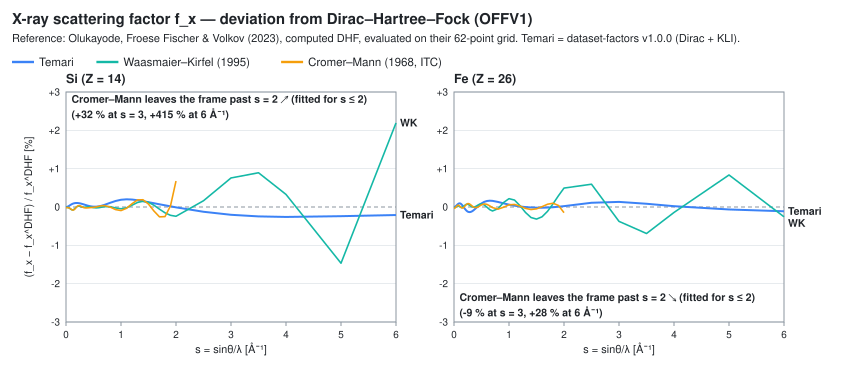
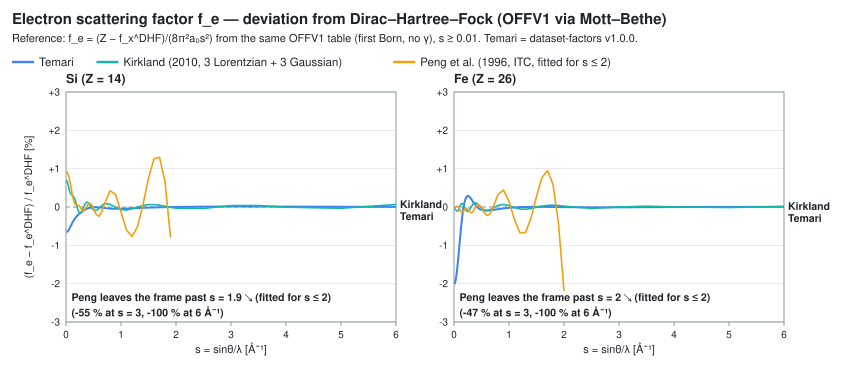
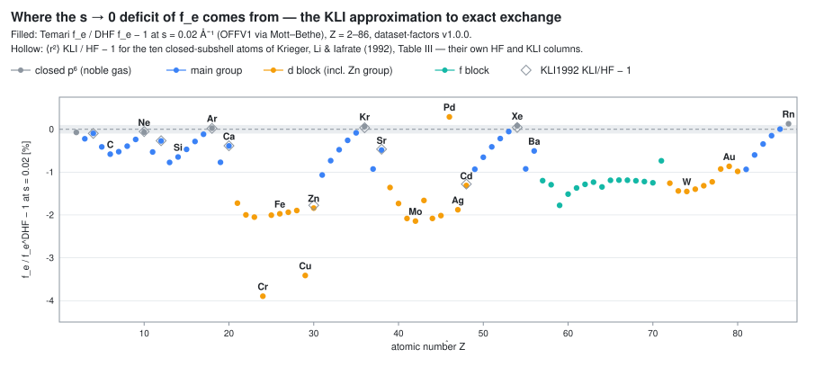
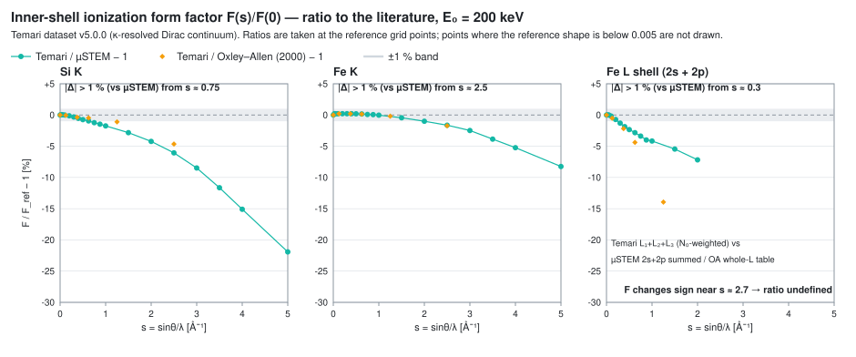

# 文献との比較

[検証](verification.md) のページは、出荷テーブルが公表された参照からどれだけ
離れているかを**数値で**述べています。このページでは同じ比較を**曲線**として
示します。代表的な 2 つの元素 — **シリコン (Si) と鉄 (Fe)** — に絞り、一致の
「形」が見えるようにしました。計算どうしがどこで重なり、どこから、どの程度の速さで
離れていくかが分かります。検証ページを先に読まなくても読めるように書いてあり、
必要な物理の用語はその都度導入します。

## 何を、何と比べるのか { #what-is-compared }

公開済みの 2 つのデータセットから、3 つの量を比べます。

| 量 | データセット | 参照 | 参照の種類 |
| --- | --- | --- | --- |
| X 線散乱因子 $f_x(s)$ | dataset-factors v1.0.0 | OFFV1 (Olukayode et al., 2023)、Waasmaier & Kirfel (1995)、Cromer & Mann (1968) | 計算表 1 つ、フィット 2 つ |
| 電子散乱因子 $f_e(s)$ | dataset-factors v1.0.0 | OFFV1 から Mott–Bethe 経由、Kirkland (2010)、Peng et al. (1996) | 計算表 1 つ、フィット 2 つ |
| イオン化形状因子 $F(s, E_0)$ | dataset v5.0.0 | Oxley & Allen (2000)、µSTEM の形状因子 (Allen et al., 2015) | 計算された形状表 2 つ |

パネルを見る前に、押さえておきたいことが 2 つあります。

**計算表はフィットではありません**。OFFV1 は原子構造計算 (Dirac–Hartree–Fock) が
62 個の $s$ の値で出した数値の集合で、これと一致することは、その物理と一致することを
意味します。Waasmaier–Kirfel、Cromer–Mann、Peng、Kirkland は*フィット*です —
Hartree–Fock 原子 (新しいフィットでは相対論的なもの) を、決められた $s$ の範囲で
再現するように調整したコンパクトな式 (Gauss 関数の和、または Gauss 関数と Lorentz
関数の和) です。フィットには元の数値に対する固有の残差があり、適用範囲の外では原子を
表す根拠がありません。ですから、以下で大きな $s$ において
フィットが計算表から離れていくとき、それは式の性質であって、その下にある物理の性質
ではありません — そして、フィットとの一致は「フィット自身の残差の範囲内」以上のことを
決して言えません。

**計算との一致は実験との一致ではありません**。ここにある参照は、どれもそれ自身が
計算です。図から分かるのは、Temari がそれらの計算に含まれる物理を再現しているか、
再現していないならどこでどの程度ずれるか、です。相関・化学結合・固体
効果は、どの計算にも同じように入っていません。

どの図が描いているのも**比か相対偏差**であって、参照値そのものではありません。
公表された数表、フィット係数、GPL ライセンスのコードの出力は、いかなる形でも
このリポジトリに入っていません
([CONTRIBUTING](https://github.com/seto77/Temari/blob/main/CONTRIBUTING.md) を参照)。
偏差の図は比較の性質を伝えますが、他人の仕事を再公表することにはなりません。
ここにあるものはすべて 1 本のスクリプト `tools/make_comparison_figures.py` が、
出荷テーブルと手元に置いた参照の複製から生成しています。

## 3 つの量を 1 段落ずつ

- **$f_x(s)$**、X 線原子散乱因子は、原子の電子密度の Fourier 変換です。
  $f_x(0) = Z$ (電子数) で、密度の広がりが有限なので、$s$ が大きくなるにつれて
  減少します。単位: 電子。
- **$f_e(s)$**、電子散乱因子は、高速電子が見るもの — 原子核と電子雲を合わせたもの —
  です。Mott–Bethe 関係式が $f_x$ からこれを与えます: $f_e = (Z - f_x)/(8\pi^2 a_0 s^2)$。
  $s = 0$ の近くでは分子の $Z - f_x$ が大きな 2 つの数の小さな差で、密度の動径
  2 次モーメントで決まります ($f_e(0) = a_0 M_2/3$)。そのため
  **$s = 0$ 付近の $f_e$ は、$f_x$ が隠してしまう外側の密度の小さな差を拡大して
  見せます**。単位: Å。規約: 第一 Born で、入射電子の相対論因子 γ は含めません —
  Doyle & Turner (1968) や Peng et al. (1996) と同じです。
- **$F(s, E_0)$**、内殻イオン化形状因子は、別の種類の量です。エネルギー $E_0$ の
  電子による 1 つの副殻 (たとえば Fe 1s) の*イオン化*が運動量移行にどう分布するかを
  記述し、$F(0) = 1$ に規格化されています。符号付きで、$E_0$ に依存し、$f_x$ でも
  $f_e$ でも断面積でもありません — [データ](data.md) を参照してください。

全体を通して $s = \sin\theta/\lambda$ を Å⁻¹ で使います ($q = 4\pi s$)。

!!! note "比のパネルの読み方"
    縦軸は $100 \times (\text{Temari}/\text{reference} - 1)$ をパーセントで表した
    もの — フィットについては $100 \times (\text{fit}/\text{reference} - 1)$ — で、
    ゼロの破線が参照*そのもの*です。+1 % にある曲線は、そこで参照より 1 % 上に
    あります。曲線が枠から出るところでは、端に張り付けずに線を切り、どこへ行ったかを
    ラベルに書いてあります。

    注意が 2 つあります。比は、因子自体が小さいところ ($f_x$ では大きな $s$、
    符号付きの $F$ ではゼロ交差の近く) で小さな絶対残差を拡大して見せるので、
    それが問題になる箇所では本文に絶対値を添えました。また、ゼロを跨ぐ比には
    まったく情報がありません — L 殻の $F$ のパネルが符号の変わる手前で止まって
    いるのはそのためです。

## 1. X 線散乱因子 f_x(s) { #fx }

**dataset-factors v1.0.0** (Dirac SCF に KLI 交換、すなわち交換のみの最適化有効
ポテンシャル (OEP) に対する KLI 近似を用いたもの) を、数値 Dirac–Hartree–Fock 表 OFFV1
(Olukayode et al., 2023) — *計算された*参照 — と、誰もが使う 2 つの解析
パラメータ化と比べます。Waasmaier & Kirfel (1995) は 5 個の Gauss 関数と定数で
$s \le 6$ Å⁻¹ に対してフィットしたもの、Cromer & Mann (1968) は *International
Tables for Crystallography* Vol. C (Prince, 2004) に収録されたもので、4 個の Gauss
関数と定数、$s \le 2$ Å⁻¹ に対してフィットしたものです。どれも OFFV1 自身の 62 点
格子の上で評価します — 参照は決して内挿せず、出荷テーブルのほうをその節点で契約
どおりのスプライン (7681 節点。内挿誤差はここで見えるどんな差よりもはるかに小さい)
で読みます。



図が示すこと:

- **$s \approx 2$ Å⁻¹ より下では、どの曲線も DHF とコンマ数パーセントの差で一致します**。
  Temari は 0–6 Å⁻¹ の*全*範囲で DHF から 0.26 % (Si)・0.17 % (Fe) 以内 —
  絶対値では最大 0.011 e (Si)・0.023 e (Fe) — に留まります。同じ物理 (Dirac、
  交換のみ、相関なし) の計算であって、それへのフィットではないからです。
- **Cromer–Mann はフィット範囲の $s = 2$ Å⁻¹ を過ぎると離れていきます**: Si では
  $s = 3$ で +32 %、$s = 6$ で +415 %、Fe では −9 % と +28 % です。これは
  「小さな $s$ で一致し、大きな $s$ で離れる」古典的なパターンで、パラメータ化の
  性質であって、フィット元の Hartree–Fock 原子の性質ではありません。
- **Waasmaier–Kirfel は $s = 6$ まで持ちます**が、$s = 2$ より下で最大 0.24 % (Si) /
  0.49 % (Fe) 振れ、遠端では最大 2.2 % (Si) 振れます。この 2.2 % は 0.005 e —
  フィットの絶対残差 — で、$f_x$ が 0.22 e まで落ちたところでの値です。

検証ページの RMS 表 ($s \le 2$ で Si / Fe が 0.087 % / 0.079 %) は、Temari の曲線の
要約統計量です。

**まとめ**。これらの原子について、Temari は交換のみの DHF に、全範囲でおよそ
4 分の 1 パーセント (0.26 % / 0.17 %) まで、$s = 2$ より下では RMS で 0.1 % 未満まで
従います。フィットは自分の範囲内では同じくらい良く、その先はそうではありません。
ここには、相関についても実験についても、何も語るものはありません。

## 2. 電子散乱因子 f_e(s) { #fe }

同じデータセット、同じ参照です。DHF には別建ての $f_e$ 表が無いので、参照は OFFV1
から Mott–Bethe 関係式 — 出荷 $f_e$ と同じ第一 Born・γ 無しの規約 — で導き、
OFFV1 の最初の節点 $s = 0.01$ から先を描きます。文献側の曲線は、Kirkland の
3 Lorentz + 3 Gauss フィット (Kirkland, 2010, Appendix C。Lorentz 型の裾を持ち、
$s \le 6$ Å⁻¹ に対してフィット) と、*International Tables* Vol. C (Prince, 2004)
収録の Peng et al. (1996) (5 個の Gauss 関数、$s \le 2$ Å⁻¹ に対してフィット) です。



図が示すこと:

- **Peng はフィット範囲の $s = 2$ Å⁻¹ を過ぎると離れ**、そのまま潰れます:
  $s = 3$ で −55 % (Si) / −47 % (Fe)、$s = 6$ では実質 −100 % です。真の $f_e$ が
  $s^{-2}$ (Rutherford) でしか落ちないところで、Gauss 関数は指数関数的に消えて
  しまいます。*International Tables* が $2 < s \le 6$ 用の第 2 の Peng の組を別に
  載せているのはこのためで、ほとんどのソフトウェアが同梱しているのは第 1 の組のほうです。
- **Kirkland は $s \approx 0.2$ Å⁻¹ から遠端まで DHF を約 0.1 % 以内で追います**。
  これが Lorentz 型の裾がもたらす利点で、正しい $s^{-2}$ 漸近形を持っています。
  唯一の逸脱は Si の $s \to 0$ (+0.7 %) です。
- **Temari は $s \approx 0.3$ Å⁻¹ から 0.25 % 以内で、$s \approx 0.5$ から上では
  0.1 % 以内で DHF と一致しますが、$s \to 0$ では下側にずれます: $s = 0.01$ で
  −0.65 % (Si)・−2.0 % (Fe) です**。ここが、$f_x$ の比較では分解できず $f_e$ の
  比較でだけ分かる唯一の箇所です。$s = 0$ 付近での $f_e$ の 2 % の差は $f_x$ では 0.03 % の差でしか
  なく、パネル 1 では見えません。その出所を次に同定します。

### s → 0 の不足はどこから来るのか { #fe-s0-deficit }

同じ量 — $s = 0.02$ Å⁻¹ での Temari の $f_e$ を DHF の $f_e$ で割ったもので、
共通の $s^2$ 項を除けば $\langle r^2 \rangle$ の比です — を全元素にわたって掃くと、
ばらつきではなくパターンが出ます:



- **希ガスはすべてゼロに乗ります** (He, Ne, Ar, Kr, Xe, Rn: −0.07 … +0.13 %)。
  Pd (4d¹⁰、5s 無し: +0.3 %) も同様です。
- **凹みは d ブロックです**: 3d 系列と 4d 系列は −1.7 … −2.1 % (Sc–Ni、Zr–Rh。Y は
  −1.4 %、Tc は −1.7 %)、5d 系列は −0.9 … −1.5 % (Hf–Hg) に居て、半分または全部
  埋まった 3d 殻の上に 4s 電子が 1 個だけ乗るところ — Cr −3.9 %、Cu −3.4 % — で
  凹みが最も深くなります。主族元素は周期ごとにゼロへ戻り、ランタノイドは
  −1.2 … −1.8 % に居ます。
- **白抜きの菱形は Temari の計算値ではありません**。KLI 近似を導入した論文
  Krieger et al. (1992) の Table III から読み取った比
  $\langle r^2 \rangle_{\rm KLI}/\langle r^2 \rangle_{\rm HF} - 1$ で、彼らが表にした
  閉副殻 (closed-subshell) の 10 原子分です。Be, Ne, Mg, Ar, Ca, Zn, Kr, Sr, Cd, Xe の
  すべてで、塗り潰しの点に 0.07 パーセントポイント以内で重なります — Zn の −1.8 %
  (その 0.07 の例) と Cd の −1.3 % も含めてです。Temari の非相対論 KLI はこれらの原子で論文の KLI 列を
  印字された 4 桁まで再現します (selftest T20 が Ne と Ar をゲートし、Mg・Ca・Zn・
  Sr・Cd も同じ方法で確認しました) から、この一致は*近似*とその参照との一致であって、
  2 つの誤差が偶然重なったものではありません。

これで、不足の原因がどこにあるかが分かります: **不足は KLI 近似そのものに追随しています**。
閉副殻の 10 原子については、これは直接の一致です。KLI 対 HF の $\langle r^2 \rangle$ が
公表されていない開殻の d 元素については、同じパターンからの推論です (有限の $s$
における Dirac + KLI 対 DHF の比較を、非相対論の KLI 対 HF の比較の横に並べたもの —
相対論の寄与と $s^2$ の寄与は、両方が揃う原子では 0.07 点の水準まで相殺していると
見えます)。同じ表で、交換のみの最適化有効ポテンシャル (OEP) は 10 原子すべて — Zn を
含めて — で Hartree–Fock と 0.1 % 以内で一致していますから、欠けているのは KLI が
OEP に対して落とすもの — 軌道シフト項 — です。それが、拡がった $n$s 電子を緻密な
$(n-1)$d 殻の上でわずかに強く束縛しすぎる、というのが Zn/Cd/Cr/Cu のパターンの
自然な読み方ですが、ここで別途証明したものではありません。

**まとめ**。出荷テーブルへの帰結は測定済みで、局所的です: $f_x$ は d ブロックの
全元素で DHF から 0.22 % 以内 (Sc 0.21 %、Cr 0.17 %、Fe 0.17 %、Cu 0.15 %、Au 0.07 %。
最悪点は $s$ = 0.3–0.7 Å⁻¹ にあり、そこでは不足分は $Z$ のごく一部です)、$f_e$ は
$s \ge 0.4$ Å⁻¹ で d ブロックが 0.16 % 以内・$s \ge 0.5$ から先は全元素が 0.14 % 以内、
そして $s \to 0$ での $f_e$ は d ブロックで最大 2 %、Cr と Cu で 4 % 低くなります。
遷移金属の $f_e(0)$ や平均内部ポテンシャルを使う方はこのことを知っておいてください。
通常の $s$ での構造因子を使う方に見えるのは、せいぜい上の 0.16 % です。

## 3. 内殻イオン化形状因子 F(s) { #f-s }

**Dataset v5.0.0** (κ 分解 Dirac 連続状態、緩和 core-hole (内殻空孔を開けて再収束した
イオン) の終状態) を、この量について存在する 2 つの参照 — Oxley & Allen (2000) の表と、
µSTEM コードに同梱して配布される形状因子 (Allen et al., 2015) — と比べます。両参照は
Hartree–Slater 原子ポテンシャルと、放出電子の 1 成分 (Schrödinger) 連続波を共有して
います。

3 者を比べられるようにするには、少し工夫が要りました。比べるのは $E_0 = 200$ keV
での**規格化された形状** $F(s)/F(0)$ で、参照の格子点で取ります (Temari の 0.05 Å⁻¹
表をそこへ内挿し、参照は内挿しません)。Oxley & Allen の L 表は L 殻全体なので、
第 3 パネルでは出荷の L₁・L₂・L₃ 行を $N_0$ 重みで合成し、µSTEM 側は別々の 2s と
2p の因子を足し合わせます — *同じ* Temari の合成形状をそれぞれの参照で割るので、
2 種類の記号どうしも比べられます。(2s : 2p の重みは副産物の検査になります: Temari の
$N_0(\mathrm{L_1}) / [N_0(\mathrm{L_2}) + N_0(\mathrm{L_3})]$ は 0.187、µSTEM の
$F_{2s}(0)/F_{2p}(0)$ は 0.189 です。)



図が示すこと:

- **1 % 以内の一致は、Si K で $s \approx 0.75$ Å⁻¹ まで、Fe K で ≈ 2 まで、Fe L 殻で
  ≈ 0.3 まで持ちます (µSTEM に対して)**。それを過ぎると Temari の形状は両参照より
  **速く**、単調に落ちます: Si K は $s = 5$ で −22 %、Fe K は −8 %、Fe L 殻は
  $s = 2$ で −7 % です。100 keV と 300 keV でも絵は同じです (Si K の曲線は 3 つの
  電圧のすべてで $s = 0.5$ と 0.75 の間で −1 % を横切ります)。軽い元素ほど、また
  上の (浅い) 殻ほど、離れ始めが早くなります — ここでは Fe K が最良の例であって、
  典型ではありません。(位置関係の参考として: Si K の $s = 1$ で、スカラー相対論
  連続状態を持つ、すでに退役した v3 表は µSTEM に対して −2.6 %、それより古い非相対論の v2 は
  −1.5 %、v5 は −1.7 % でした — κ 分解 Dirac 連続状態は形状を非相対論の結果から
  0.2 点以内に戻したわけで、真の相対論効果が小さいのですから、そうなるべきです。)
- **2 つの参照もまた互いに食い違います**。L 殻でより顕著で、分子を同じ Temari の
  合成形状にすると、$s = 1.25$ で Oxley–Allen の L 殻全体は −14 %、µSTEM の 2s + 2p
  は約 −5 % を与えます。つまり、そこで Oxley–Allen は µSTEM より 11 % ほど上に
  あります ($s = 0.625$ では 1.6 %)。K では 2 つの参照は $s = 2.5$ まで互いに 1.5 %
  (Si)・0.1 % (Fe) で一致します。
- **L 殻の比は $s = 2$ で終わります**。$F$ が $s \approx 2.7$ Å⁻¹ の付近で符号を
  変えるためです (出荷の $F$ は符号付きです — [データ](data.md) を参照)。ゼロを跨ぐ
  比には情報がありません。

**この比較では決められないこと**。大きな $s$ でどちらの側が真値に近いか — その水準の
実験との比較はここでは使っていませんし、L 殻では 2 つの参照どうしもそこで一致して
いません (K では 2 つの参照は $s = 2.5$ まで互いに 1.5 % で一致しているので、そこでは
Temari は互いに一致する 2 つの参照から離れていることになります — それでも、どちらが
正しいかは言えません)。分かっているのは、テーブルが使われる量にとって、それが
どれだけ効くかです:
[伝播の測定](https://github.com/seto77/Temari/blob/main/docs/observable_propagation_2026-08-13.md)
によれば、STEM-EDX/ALCHEMI の観測量が感じるのは $s < 2$ Å⁻¹ だけで、$s > 4$ の寄与は
10⁻⁹ の水準でした — 試した 1 結晶 1 方位についてです。曲線が離れる領域は、それらの
観測量にとっては効かない領域であり、効く領域は一致している領域です。

## 比較から分かること { #take-away }

| 量 | 結論してよいこと | 結論してはいけないこと |
| --- | --- | --- |
| $f_x$ | 示した原子について、Temari は交換のみの DHF に 0–6 Å⁻¹ でコンマ数パーセントの差で従う ($s = 2$ より下では RMS 0.1 % 未満) — 標準的なフィットがそれ自身の範囲内で見せる出来と同等で、しかもフィット範囲の制限なしに 0–6 Å⁻¹ 全域で計算されている | 原子が完全であること (相関も結合も実験も入っていない) |
| $f_e$ | 通常の $s$ では同上。d ブロックでは $s \to 0$ で最大 2 % (Cr、Cu では 4 %) の KLI 固有の不足があり、近似そのものに帰着した | どの遷移金属も一定の割合だけずれていること、あるいは不足が通常の $s$ での構造因子に及ぶこと |
| $F(s, E_0)$ | 形状は参照と $s \approx 0.75$ (Si K)、2 (Fe K)、0.3 Å⁻¹ (Fe L 殻) まで 1 % 以内で一致し、その先はより速く落ちる。試した観測量が応答するのは $s < 2$ だけで、そこでの離れは Si K と Fe L 殻で数パーセント、Fe K で 1 % に達する。L 殻の参照どうしは 11 % 食い違う | 大きな $s$ でどちらかの側が正しいこと。1 つの結晶の伝播結果があらゆる観測量をカバーすること |

## 図の再生成 { #regenerating }

```bash
python tools/make_comparison_figures.py              # Si and Fe, E0 = 200 keV
python tools/make_comparison_figures.py --z 14,26,79 # more columns
python tools/make_comparison_figures.py --e0 300     # another E0 for F(s)
```

スクリプトは、参照がローカルディスクにあることを前提にします (リポジトリには
入っていません — 何をどこに置くかは `refs/README.md` に一覧があります)。書き出すのは
比と偏差だけで、出力先は `docs/src/assets/figures/` です。端末にも同じ偏差を印字
しますが、参照値は決して印字しません。SVG が運んでいるのは比で、分解能はおよそ
10⁻⁴ パーセントポイント — 導出された比較の図です。そこが貢献ガイドラインの引いている線で、
偏差と比は公開してよく、転記した値は公開してはいけません。

## 参考文献

- Allen, L. J., D'Alfonso, A. J. & Findlay, S. D. (2015). Modelling the inelastic scattering of fast electrons. *Ultramicroscopy* **151**, 11–22.
- Cromer, D. T. & Mann, J. B. (1968). X-ray scattering factors computed from numerical Hartree–Fock wave functions. *Acta Crystallographica A* **24**, 321–324.
- Doyle, P. A. & Turner, P. S. (1968). Relativistic Hartree–Fock X-ray and electron scattering factors. *Acta Crystallographica A* **24**, 390–397.
- Kirkland, E. J. (2010). *Advanced Computing in Electron Microscopy*, 2nd ed. Springer, New York.
- Krieger, J. B., Li, Y. & Iafrate, G. J. (1992). Construction and application of an accurate local spin-polarized Kohn–Sham potential with integer discontinuity: Exchange-only theory. *Physical Review A* **45**, 101–126.
- Olukayode, S., Froese Fischer, C. & Volkov, A. (2023). Revisited relativistic Dirac–Hartree–Fock X-ray scattering factors. I. Neutral atoms with Z = 2–118. *Acta Crystallographica A* **79**, 59–79.
- Oxley, M. P. & Allen, L. J. (2000). Atomic scattering factors for K-shell and L-shell ionization by fast electrons. *Acta Crystallographica A* **56**, 470–490.
- Peng, L.-M., Ren, G., Dudarev, S. L. & Whelan, M. J. (1996). Robust parameterization of elastic and absorptive electron atomic scattering factors. *Acta Crystallographica A* **52**, 257–276.
- Prince, E. (ed.) (2004). *International Tables for Crystallography*, Vol. C, 3rd ed. Kluwer, Dordrecht.
- Waasmaier, D. & Kirfel, A. (1995). New analytical scattering-factor functions for free atoms and ions. *Acta Crystallographica A* **51**, 416–431.
